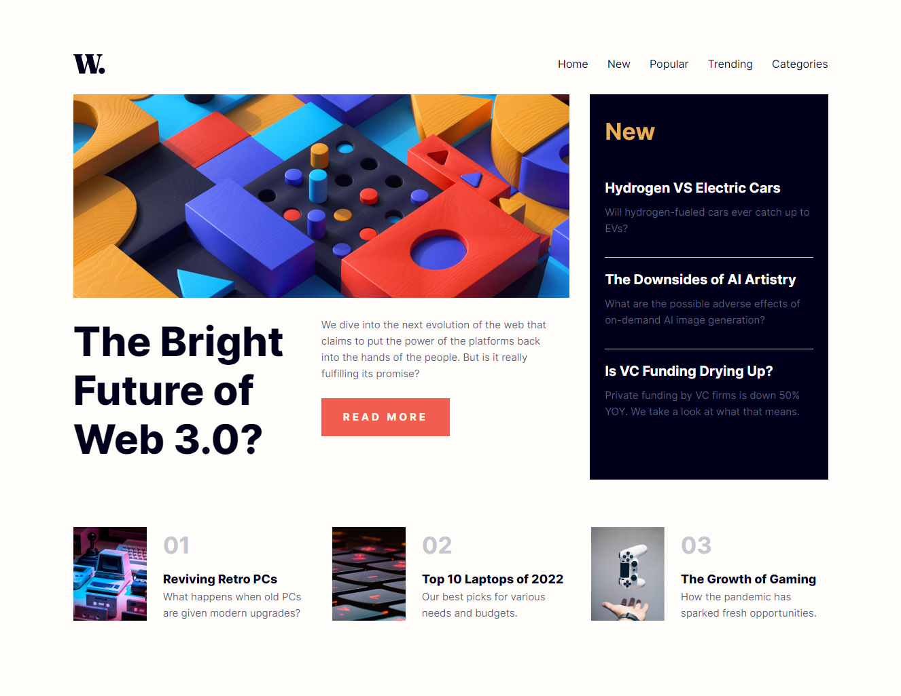
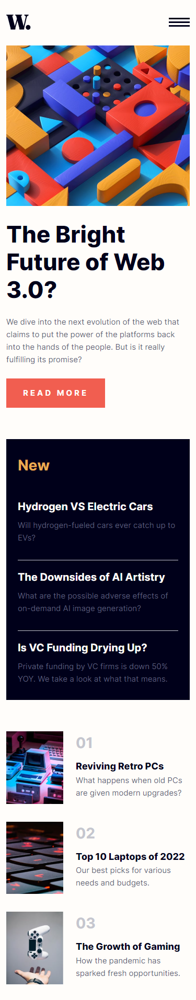

# Frontend Mentor - News homepage solution

This is a solution to the [News homepage challenge on Frontend Mentor](https://www.frontendmentor.io/challenges/news-homepage-H6SWTa1MFl). Frontend Mentor challenges help you improve your coding skills by building realistic projects.

## Table of contents

- [Overview](#overview)
  - [The challenge](#the-challenge)
  - [Screenshot](#screenshot)
  - [Links](#links)
- [My process](#my-process)
  - [Built with](#built-with)
  - [Author](#author)

## Overview

### The challenge

Users should be able to:

- View the optimal layout for the interface depending on their device's screen size
- See hover and focus states for all interactive elements on the page
- **Bonus**: Toggle the mobile menu (requires some JavaScript)

### Screenshot

|                    Desktop View                     |                    Mobile View                    |
| :-------------------------------------------------: | :-----------------------------------------------: |
|  |  |

### Links

- Solution URL: [Frontend mentor solution link](https://your-solution-url.com)
- Live Site URL: [Live website link](https://your-live-site-url.com)

## My process

### Built with

- Semantic HTML5 markup
- CSS custom properties
- Flexbox
- CSS Grid
- Mobile-first workflow

## Author

- Frontend Mentor - [@Shard-Codes](https://www.frontendmentor.io/profile/Shard-Codes)
- Twitter - [@Shard_Codes](https://twitter.com/Shard_Codes)

Thanks for viewing my project, Have a nice day!
